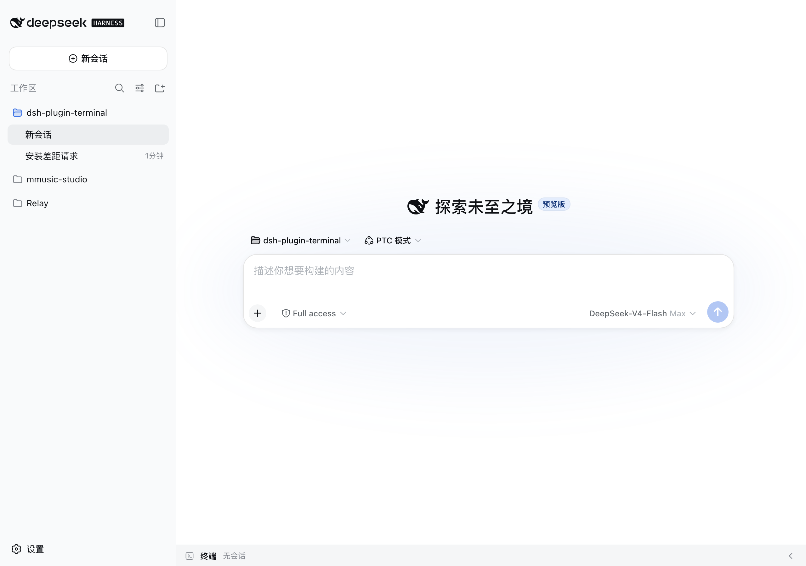
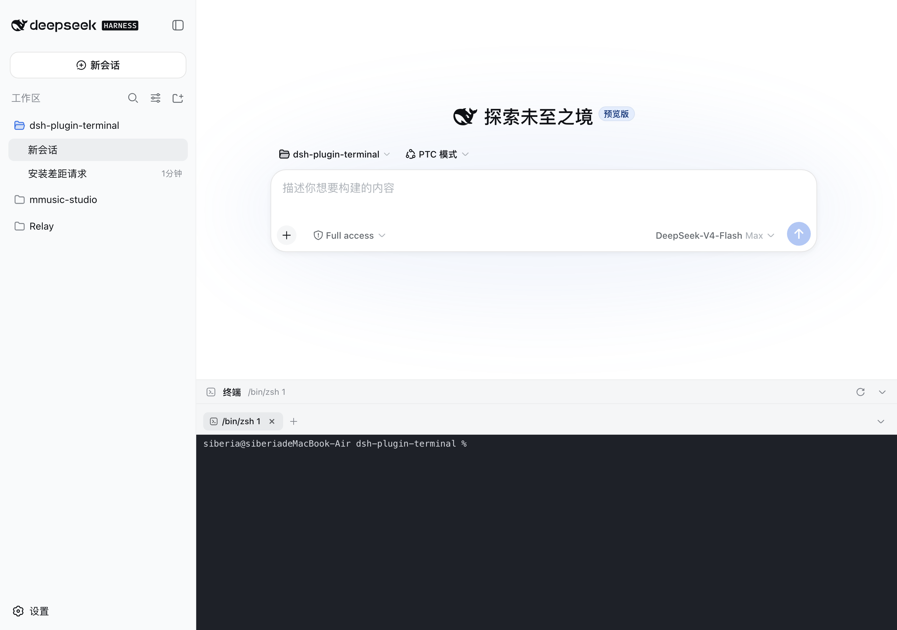

# dsh-plugin-terminal

Bottom terminal panel for the DeepSeek Harness (DSH) Web GUI — an interactive multi-tab shell pinned to the bottom of the page (openpty on Linux/macOS, ConPTY on Windows).

MIT

## Install

```sh
dsh plugin --profile web add dsh-chinchilla-plugin-terminal && dsh web
```

Then toggle the panel with **Ctrl+\`** (configurable).

> Note: this is a DSH (DeepSeek Harness) plugin — do **not** use plain `npm i dsh-chinchilla-plugin-terminal`; it must be installed through `dsh plugin` to activate.

Uninstall:

```sh
dsh plugin --profile web remove dsh-chinchilla-plugin-terminal
```

| Collapsed | Expanded | Multi-tab |
|---|---|---|
|  |  |  |

## Features

- Bottom panel pinned to the viewport, aligned with the conversation column; the input box always stays above the terminal
- Configurable shortcut toggles (default `Ctrl+``, e.g. `Ctrl+J`); drag the top grip to resize (120px–78% viewport, remembered)
- Multi-tab: `+` new, ✕ close, ⟳ restart; processes keep running on tab switch; live sessions restore after refresh or workspace switch
- Every terminal remembers its working directory: new tabs start in the current DSH workspace; after a `dsh web` restart, ⟳ brings the process back in its original directory instead of the server launch directory
- **Terminals survive dsh web restarts**: session metadata + scrollback are persisted live to `$DSH_HOME/plugin-data/terminal/`; after a restart they come back as "exited" history tabs (full screen replay, one-click restart of the process); tabs you closed stay closed
- xterm.js 6: colors, blinking cursor, alternate screen, Unicode v11 (CJK width tables), 10000-line scrollback
- WebSocket duplex channel to the PTY; dark terminal surface in both light and dark themes
- Copy/paste: select with the mouse and release to copy, right-click to paste; `Ctrl+V` pastes, `Ctrl+Shift+C` / `Ctrl+Shift+V` copy/paste when the clipboard API is available
  - ⚠️ When the GUI is opened over **remote http** (not https / not localhost) browsers disable `navigator.clipboard` (insecure context) - the plugin falls back to `execCommand` copy and lets the browser's native context-menu Paste through, so both still work

## Working directory

New terminals open in the **workspace of the conversation you opened them in** — the same folder shown in that session's file paths. Resolution order:

1. The conversation's workspace path (the client sends it with every new-tab request)
2. The session's recorded cwd (covers subagent sessions, which inherit their parent's workspace)
3. The DSH workspace registry, looked up by session id (server-side fallback)
4. The `dsh web` launch directory (last resort only)

Restart (⟳) always inherits the directory the tab was in before. If a terminal appears in an unexpected folder, check which conversation it was opened in — or hover a tab: the tooltip shows its working directory.

## Configuration

Plugin behavior lives in the DSH settings document (`$DSH_HOME/settings.yaml`, section `terminal`), editable from the GUI at **Settings → Plugins**. Changes apply to sessions created afterwards — no restart needed; tabs that already exist keep the command they started with.

| Field | Default | Meaning |
|---|---|---|
| `toggleShortcut` | `ctrl+`` | Keyboard shortcut toggling the bottom panel. Format: `[ctrl|shift|alt|meta]+[...]+key`, e.g. `ctrl+j`, `ctrl+shift+f1`. The key can be a letter, digit, F1–F12, or a name (```, space, enter, tab, up/down/left/right, home/end, pageup/pagedown, delete, backspace, escape). |
| `shellCommand` | *(empty — auto-detect)* | Command line used to start **new** terminal sessions. Empty means the platform default (pwsh/powershell/cmd on Windows, `$SHELL` on POSIX). |

Example — launch cmder on Windows and bind the panel to Ctrl+J:

```yaml
terminal:
  toggleShortcut: ctrl+j
  shellCommand: cmd.exe /k "C:\cmder\vendor\init.bat"
```

Notes:

- `shellCommand` is used verbatim (no flags are injected): the command line is split on spaces with double quotes honored, so quoted paths work.
- If the shortcut is a key the terminal also consumes (Ctrl+J is the shell's line feed), a press while a terminal pane has focus goes to the shell instead of toggling the panel.
- Operator override: the environment variables `DSH_PLUGIN_TERMINAL_TOGGLE_SHORTCUT` and `DSH_PLUGIN_TERMINAL_SHELL_COMMAND` take precedence over the settings document (and are the only way to configure headless compositions without the settings service).

## Local development (use the repo directly)

Install a link to your checkout instead of the npm package — every change in the checkout is live after a restart:

```sh
git clone <your-fork-url> && cd dsh-plugin-terminal
npm install                                   # also runs npm run build (prepare)
dsh plugin --profile web add /absolute/path/to/dsh-plugin-terminal
dsh web
```

| What you changed | What to do next |
|---|---|
| `src/` (client bundle) | `npm run build` in the checkout → restart `dsh web` → hard-refresh the browser (Ctrl+Shift+R) |
| `lib/index.js` (server) | restart `dsh web` |
| settings (`terminal:` section) | nothing — applies to new tabs |

- `npm` is the package manager (a committed `package-lock.json` pins everything).
- `npm test` runs the full suite (config parsing, WS origin check, env smoke, cwd persistence, restart inheritance, persist/restart).
- Because it is a **link**, the plugin resolves its dependencies from the checkout's `node_modules` — don't delete or move the checkout while the profile uses it.

## Releasing

Releases are manual GitHub Actions runs — no tags are ever pushed by hand, and CI never rewrites versions:

1. Bump `version` in `package.json` (must be newer than, and not already published as, any npm version) and commit.
2. GitHub → **Actions** → `release` → **Run workflow** → enter the version, e.g. `v0.3.0`.
3. The workflow validates the version against package.json and the npm registry, builds the client bundle, runs the tests, creates a GitHub release with the packed `.tgz`, then publishes to npm with `--provenance`.

No npm token is stored: publishing uses **npm Trusted Publishing** (GitHub OIDC). One-time setup on [npmjs.com](https://www.npmjs.com): **Access → Publish with Trusted Publishers → Add** the GitHub repository, claiming it under the `production` environment (create it under the repo's Settings → Environments if it doesn't exist yet).

## Security

- PTY session metadata and scrollback logs are written under `$DSH_HOME/plugin-data/terminal/` with owner-only permissions (directories `0700`, files `0600`); per-tab log capped at 1 MB (trimmed to the last screenful of scrollback).
- WebSocket handshake rejects cross-origin requests (origin must match the host); input frames larger than 1 MB are dropped.
- Terminal web links (xterm.js WebLinks) open only `http(s)` URIs, with `noopener,noreferrer`.
- `node-pty` is the only native dependency; it ships prebuilt binaries for common platforms and is otherwise built from source at install time.

## Running codex / claude code in the panel

These AI coding CLIs are full-screen TUIs (ANSI escapes + alternate screen + truecolor) and demand a lot from the terminal link. The plugin is tuned for them:

- Child env gets TERM=xterm-256color and COLORTERM=truecolor (when unset), plus LANG/LC_ALL=en_US.UTF-8 and PYTHONIOENCODING=utf-8 on non-Windows, preventing 256-color fallback and CJK mojibake
- xterm.js 6 answers OSC 10/11/12 queries out of the box (Codex theme detection via background-color query just works)
- unicodeVersion "11" keeps mixed CN/EN output aligned; drawBoldTextInBrightColors: false keeps true colors on bold text; CJK fallbacks in the font stack; 10000-line scrollback (500k-char server ring buffer)

If rendering still misbehaves:

- **Claude Code**: run `/tui fullscreen` in the session (or `CLAUDE_CODE_NO_FLICKER=1 claude`) to switch to the flicker-free fullscreen renderer; `/tui default` reverts
- **Inside tmux**: make sure `TERM=tmux-256color` and tmux >= 3.4, add `set -ga terminal-overrides ',xterm-256color:RGB'` if needed
- **Windows mojibake**: use Windows Terminal, `chcp 65001`, enable the "Beta: Use Unicode UTF-8" system option; fall back to WSL if it persists
- **Update the CLI**: most rendering bugs are regressions already fixed in newer versions

## License

MIT
