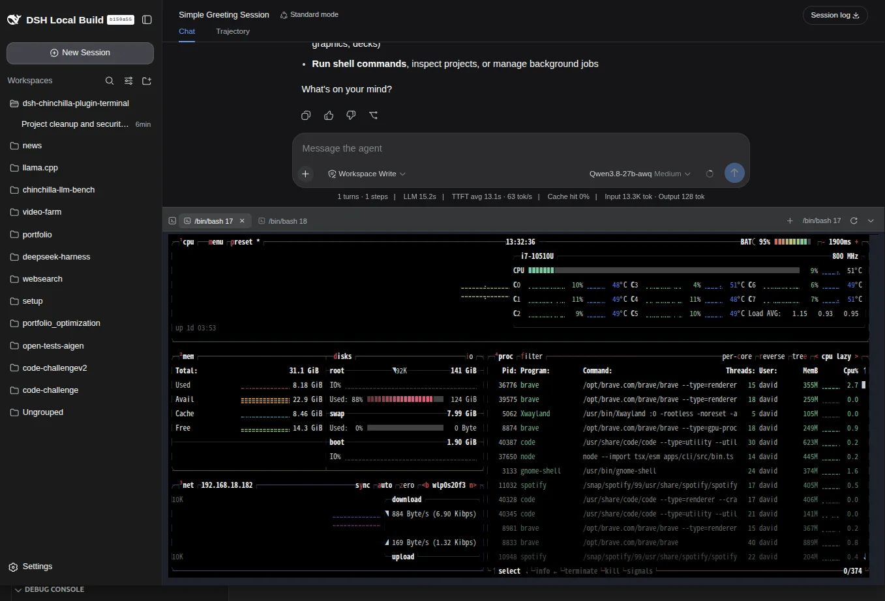

# dsh-chinchilla-plugin-terminal

Bottom terminal panel for the DeepSeek Harness (DSH) Web GUI — a multi-tab shell pinned to the bottom of the page (openpty on Linux/macOS, ConPTY on Windows).

MIT



## Install

```sh
dsh plugin --profile web add dsh-chinchilla-plugin-terminal && dsh web
```

Toggle with **Ctrl+\`** (configurable). This is a DSH plugin — install it with `dsh plugin`, not plain `npm i`.

Uninstall:

```sh
dsh plugin --profile web remove dsh-chinchilla-plugin-terminal
```

## Features

### Automatic workspace location

New terminals open in the **workspace of the conversation** they were opened in — no manual `cd` needed. The working directory is resolved from the conversation workspace, falls back to the DSH session's registered path, and finally to the server's launch directory. Restarting a session (⟳) inherits the tab's current directory, and hovering a tab shows its exact working directory.

### Multi-tab

- `+` new tab, ✕ close, ⟳ restart — each tab runs its own shell process
- Processes **keep running** while you switch tabs (no respawn, no lost state)
- Live sessions are restored after a page refresh or a workspace switch; closed tabs stay closed

### Safety limits

| Limit | Value | Why |
|---|---|---|
| Scrollback | 10,000 lines (500 KB server ring) | bounded memory per tab |
| Per-tab output log | 1 MB | capped on disk |
| WS input frames | > 1 MB dropped | paste-flood protection |
| Panel height | 120 px – 78% of viewport | the panel can never cover the whole screen |

### Survives `dsh web` restarts

Sessions, working directories, shell commands and scrollback are persisted under `$DSH_HOME/plugin-data/terminal/` (0700 dir / 0600 files). After a restart, terminals come back as **"exited" history tabs** with the full screen replay and one-click restart — nothing is silently lost.

### Terminal rendering (xterm.js 6)

256 colors + truecolor, alternate screen, Unicode v11 (CJK), OSC 10/11/12 (foreground/background/pointer colors), web links restricted to `http(s)` and opened in a new tab.

### Copy & paste

- Mouse select → copy on release
- Right-click or **Ctrl+V** to paste
- **Ctrl+Shift+C / Ctrl+Shift+V** browser-standard shortcuts
- Automatic fallback for insecure (http) contexts where `navigator.clipboard` is unavailable

### Configurable

- `toggleShortcut` — panel toggle shortcut (default `ctrl+``; accepts `ctrl+j`, `alt+shift+t`, `f1`, …)
- `shellCommand` — custom shell command for new sessions (empty = auto-detect: `$SHELL` on Linux/macOS, `pwsh` on Windows)

### Drag-to-resize

Drag the grip on the panel's top edge to resize; the height is remembered.

### Cross-platform

openpty on Linux/macOS, ConPTY on Windows — no native build needed (prebuilt N-API binaries, runs in Docker/CI as-is).

### Security

- WebSocket origin check: sockets not opened by the DSH web app are rejected
- Persisted data is created with owner-only permissions (`0700`/`0600`)
- No network access, no telemetry — the plugin only talks to its own local PTY

## Configuration

Settings live in `$DSH_HOME/settings.yaml` (section `terminal`), editable under **Settings → Plugins**. Changes apply to new tabs — no restart needed.

| Field | Default | Meaning |
|---|---|---|
| `toggleShortcut` | `ctrl+`` | Panel toggle shortcut, e.g. `ctrl+j`, `ctrl+shift+f1` |
| `shellCommand` | *(empty — auto-detect)* | Command line for **new** sessions; empty = platform default (`$SHELL` / pwsh) |

## Local development

```sh
git clone https://github.com/DavidCastilloAlvarado/dsh-chinchilla-plugin-terminal.git
cd dsh-chinchilla-plugin-terminal
npm install        # also runs npm run build
dsh plugin --profile web add /absolute/path/to/dsh-chinchilla-plugin-terminal
dsh web
```

- Changed `src/` (client) → `npm run build`, restart `dsh web`, hard-refresh the browser
- Changed `lib/index.js` (server) → restart `dsh web`
- `npm test` runs the full suite
- It's a link install: the plugin resolves deps from the checkout's `node_modules` — don't move or delete the checkout while the profile uses it
